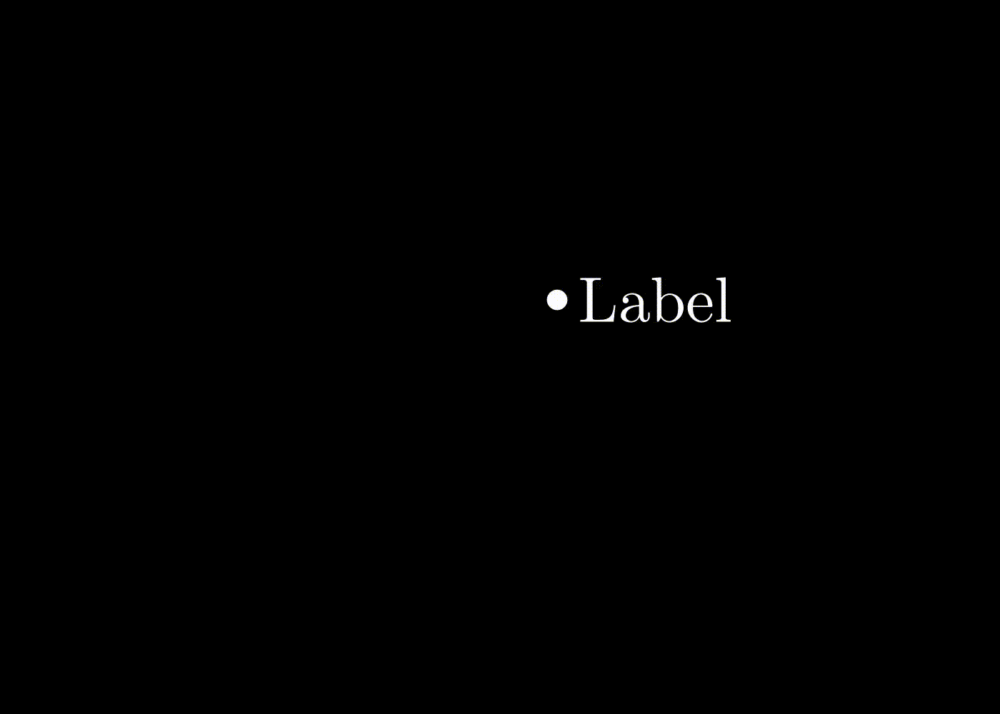

<!--ts-->
   * [Manim](#manim)
      * [Options](#options)
      * [Operations](#operations)
         * [Add/remove text from the screen without animation](#addremove-text-from-the-screen-without-animation)
         * [Adding text to the screen with animation](#adding-text-to-the-screen-with-animation)
      * [Text transformations](#text-transformations)
      * [animations](#animations)
      * [Positions](#positions)
         * [Absolute position](#absolute-position)
            * [to_edge(DIRECTION)](#to_edgedirection)
            * [to_corner(CORNER_TYPE)](#to_cornercorner_type)
         * [Relative position](#relative-position)
            * [move_to()](#move_to)
            * [next_to()](#next_to)
            * [shift(DIRECTION)](#shiftdirection)
      * [Rotating](#rotating)
         * [Rotate an element around it's center](#rotate-an-element-around-its-center)
         * [Rotate an element with a point as a reference](#rotate-an-element-with-a-point-as-a-reference)
      * [Flipping](#flipping)
      * [Update functions](#update-functions)
         * [Example 1](#example-1)
         * [Example 2](#example-2)
      * [Contstants](#contstants)

<!-- Added by: gil_diy, at: 2020-04-26T10:19+03:00 -->

<!--te-->

# Manim


```bash
pipenv run python manim.py example_scenes.py SquareToCircle -pl
```

## Options

shorthand | option | Description
------------|----- |-------------
 `-p`|  `--preview` | Automatically open the saved file once its done
 `-w`| `--write_to_movie` | Render the scene as a movie file
 `-l`| `--low_quality` | Render at a low quality (for faster rendering)
 `-i`|`--save_as_gif`| Save the video as gif
 `-g`| `--save_pngs` | Save each frame as a png
 `-t`|`--transparent`| Render to a movie file with an alpha channel
 `-o`| `--file_name` | Specify the name of the output file
 `-r`| `--resolution` | Resolution, passed as \"height,width\"
  ``| `--video_output_dir` | directory to write video


## Operations

### Add/remove text from the screen without animation

```python
text = TextObject("my text")
self.add(text)
self.wait() # waits 1 second by default
self.remove(text)
self.wait() # waits 1 second by default
```


[Reference](https://www.youtube.com/watch?v=QEdVn8socC8&list=PL2B6OzTsMUrwo4hA3BBfS7ZR34K361Z8F&index=13)

```python
class FormulaColor1(Scene):
	def construct(self):
		text = TextMobject("x","=","{a","\\over","b}").scale(3)

		text[0].set_color(RED)
		text[1].set_color(BLUE)
		text[2].set_color(GREEN)
		text[3].set_color(ORANGE)
		text[4].set_color(YELLOW)

		self.play(Write(text))
		self.write(2)
```
### Adding text to the screen with animation
```python
text = TextObject("my text")
self.play(FadeIn(text), run_time=3) # Animation will take 3 seconds
```
## Text transformations

```python
class TransfromationText1V1(Scene):
    def construct(self):
        text_object1 = TextMobject("First text")
        text_object2 = TextMobject("Second text")
        self.play(Write(text_object1))
        self.wait()
        self.play(Transform(text_object1, text_object2))
        self.wait()
```


## animations

All animationes appear in `./manimlib/animation` .

Function | Description
------------|-----
 FadeIn | element-description
 FadeInFrom | 
 FadeInFromDown | 
 FadeInFromPoint |
 FadeInFromLarge |  
 VFadeIn | 
 FadeOutAndShift |  
 FadeOutAndShiftDown | 
 VFadeOut | 
 VFadeInThenOut
  |


## Positions

### Absolute position

#### to_edge(DIRECTION)
use the predefine directions, for example:

```python
.to_edge(UP)
.to_edge(DOWN)
.to_edge(LEFT)
.to_edge(RIGHT)
```

#### to_corner(CORNER_TYPE)

To the corner, we can use:

```python
.to_corner(UR) # Up Right
.to_corner(UL) # Up Left
.to_corner(DR) # Down Right
.to_corner(DL) # Down Left
```

For example:
```python
class PositionsExmaple(Scene):
	object = Dot()
	object.to_edge(DOWN)
	self.add(object)
	self.wait()
```

* In case you want to decrease the size of the border, so the element will be closer to the edge use: `.to_edge(DIRECTION, buff=NUMBER)`

* Comment the predefined Constants are declared in: `./manimlib/constants.py`


### Relative position

#### move_to()

```python
	class PositionsExampleRelative(Scene):
		def construct(self):
		    grid = ScreenGrid()
		    my_dot = Dot()
		    
		    referenceText = TextMobject("Destination")

		    my_dot.move_to(-3*LEFT + 2*UP)

		    referenceText.move_to(my_dot.get_center() + 5*RIGHT)

		    self.add(grid,my_dot, referenceText)
		    self.wait()
```

#### next_to()

#### shift(DIRECTION)

Moves the object with **one unit** towards the direction:

my_dot.shift(RIGHT)


## Rotating

### Rotate an element around it's center

```python
	class RotateObject(Scene):
		def construct(self):
			textM = TextMobject("Text")
			textC = TextMobject("Reference text")
			textM.shift(UP)
			textM.rotate(PI/4) # <- Radians
			# You can use .rotate(45*DEGREES) too
			self.play(Write(textM), Write(textC))
			self.wait(2)
			textM.rotate(PI/4)
			self.wait(2)
			textM.rotate(PI/4)
			self.wait(2)
			textM.rotate(PI/4)
			self.wait(2)
			textM.rotate(PI)
			self.wait(2)

```	
### Rotate an element with a point as a reference

```python
my_object.rotate(110*DEGREES, about_point = point)
```
## Flipping


```python
class FlipObject(Scene):
	def construct(self):
		textM = TextMobject("Text")
		textM.flip(UP)
		self.play(Write(textM))
		self.wait(2)
```

## Update functions

### Example 1

```python
class AddUpdater1(Scene):
    def construct(self):
        dot = Dot()
        text = TextMobject("Label")
        text.next_to(dot, RIGHT, buff=SMALL_BUFF)

        self.add(dot, text)

        # Update function
        def update_text(obj):
            obj.next_to(dot, RIGHT, buff=SMALL_BUFF)

        # Add update function to the objects
        # So now the text will always be to the right of the dot regardless
        # of the point's position.
        text.add_updater(update_text)

        # Add the object again
        self.add(text)
        self.play(dot.shift, UP * 2)
        # Remove update function`
        text.remove_updater(update_text)
        self.wait()
```


### Example 2

```python
class AddUpdater2(Scene):
    def construct(self):
        dot = Dot()
        text = TextMobject("Label")
        text.next_to(dot, RIGHT, buff=SMALL_BUFF)

        self.add(dot, text)

        # Update function
        def update_text(obj):
            obj.next_to(dot, RIGHT, buff=SMALL_BUFF)

        # Add update function to the objects
        # So now the text will always be to the right of the dot regardless
        # of the point's position. this is type of grouping
        text.add_updater(update_text)

        # Add the object again
        self.add(text)
        self.play(dot.shift, UP * 2, run_time=1)
        self.play(dot.shift, LEFT * 2, run_time=1)
        self.play(Rotating(dot, radians=PI, about_point=ORIGIN), run_time=2)
        # Remove update function`
        text.remove_updater(update_text)
        self.wait()
```




## Contstants

For adding new colors:

```bash
./manimlib/constants.py
```	
